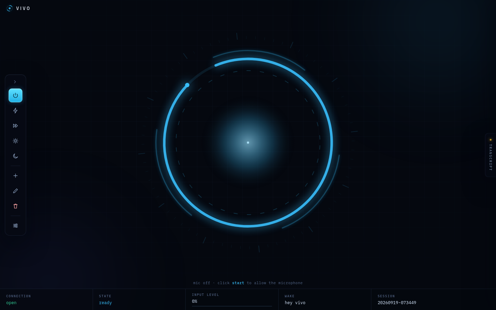
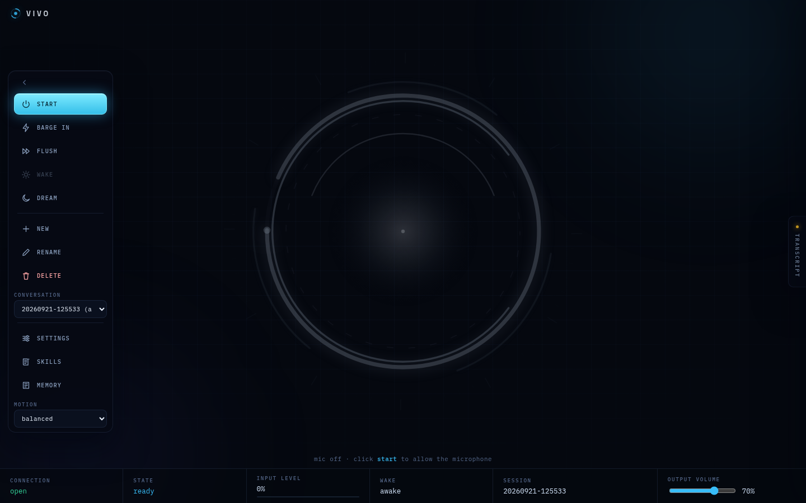
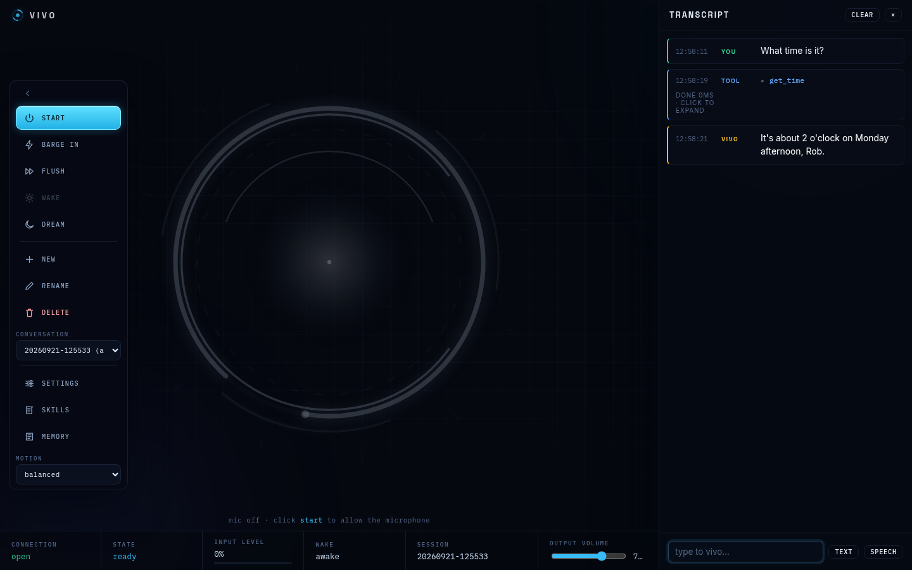
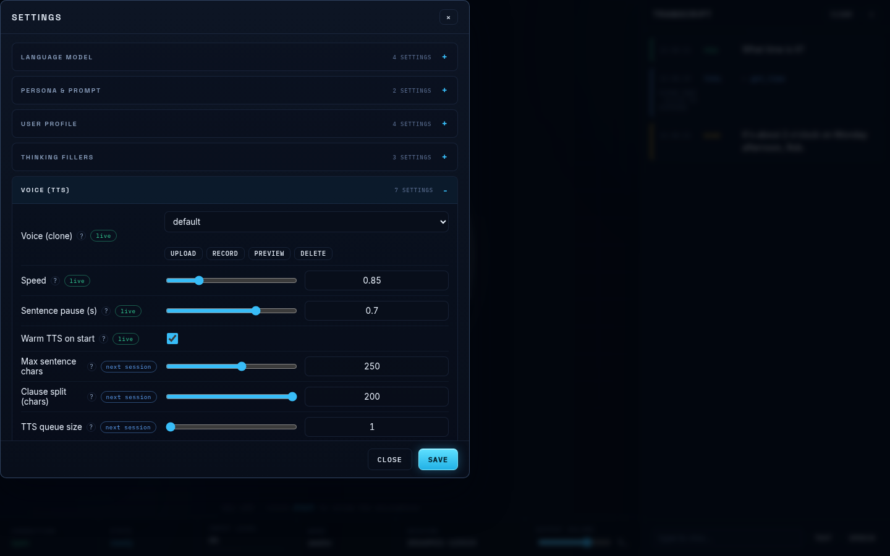
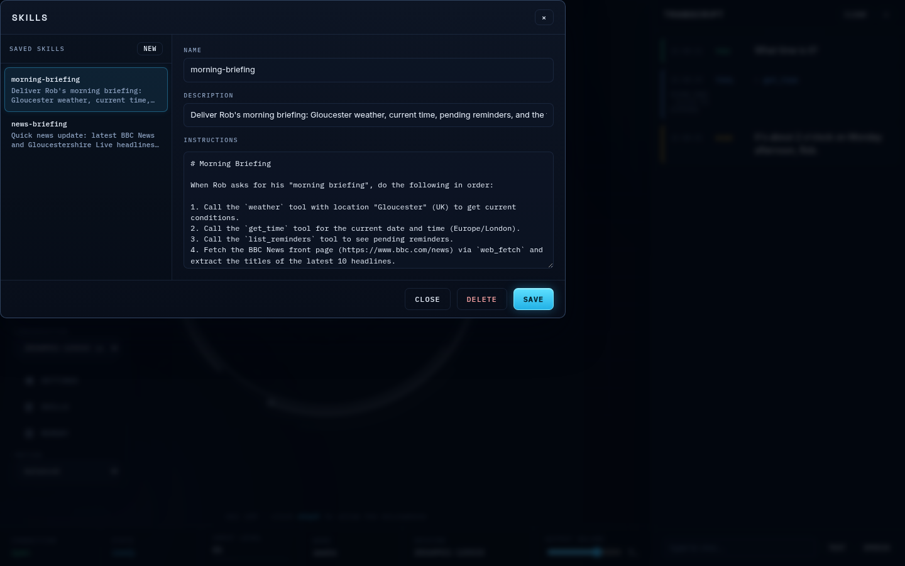
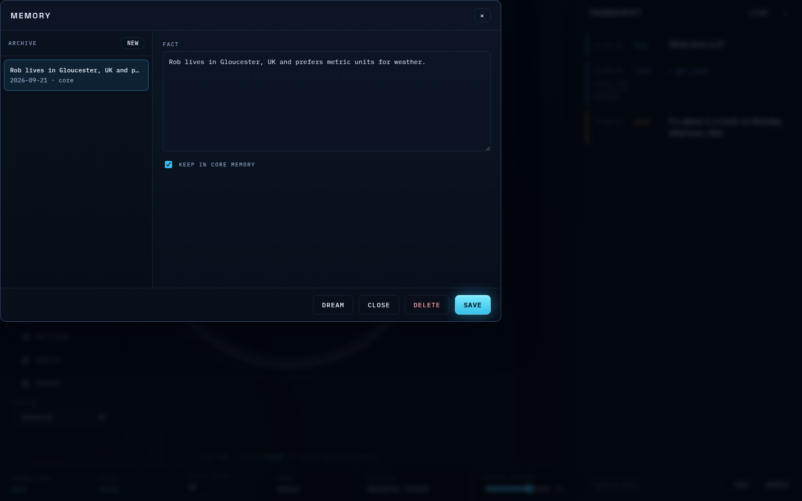
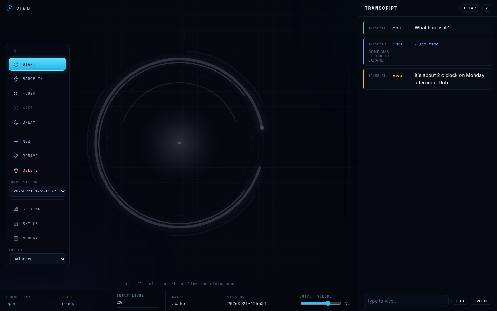

# Vivo — Local Voice Agent for Docker + llama.cpp

Vivo is a CPU-only voice assistant that runs entirely on your machine in one Docker container. It listens through the browser mic, transcribes speech, calls a local LLM, and speaks back with a cloned or default voice — no GPU, no cloud API keys, and no custom backend required.

Built for local-first personal assistance: quick conversations, file and shell access inside a workspace, memory, reminders, and tools for browsing and task execution without leaving the browser.



## Screenshots

A quick look at the app in action:

<table>
  <tr>
    <td></td>
    <td></td>
  </tr>
  <tr>
    <td></td>
    <td></td>
  </tr>
  <tr>
    <td></td>
    <td></td>
  </tr>
</table>

## Features

- **Real-time conversation** — mic audio → VAD → speech-to-text → LLM → text-to-speech, all streaming
- **Barge-in** — interrupt vivo mid-reply by speaking; the LLM stream and TTS abort instantly
- **Wake word** — configurable wake phrase (e.g. "hey vivo") puts vivo to sleep; it wakes only when addressed
- **Voice cloning** — upload or record a 3–30 s reference clip; vivo speaks in that voice
- **Thinking mode** — the LLM reasons silently before answering; vivo speaks filler phrases while thinking
- **Named sessions** — switch between conversations; each persists to disk
- **Memory compaction** — older turns are summarised by the LLM in the background to keep context manageable
- **Two-tier memory** — `data/memory.md` holds curated core facts for the prompt; `data/memory.json` keeps the editable local archive
- **21 built-in tools** — shell (sandboxed), files, memory, skills, conversations, web search, web fetch, time, weather, reminders
- **Settings pane** — every config value is editable live from the UI; changes write `vivo.toml` automatically

## Architecture

```
Browser (mic + playback + UI)
   │  WebSocket (PCM 16 kHz up, PCM 48 kHz down)
   ▼
FastAPI (uvicorn)
    ├── VAD: Silero v6 → speech endpointing
    ├── STT: faster-whisper small int8
    ├── Wake: transcript-matched wake phrase
    ├── Agent: streaming tool loop → llama.cpp v1
    │     ├── 21 built-in tools + spoken fillers during reasoning
    ├── Memory: named sessions, idle-time LLM compaction
    └── TTS: LuxTTS voice cloning (48 kHz), sentence-chunked streaming
```

## Prerequisites

- **Docker + Compose**
- **CPU with ≥8 cores** (24 cores recommended for responsiveness)
- **llama.cpp server** with an OpenAI-compatible `/v1` endpoint:
  - Tool calling enabled: `--tools all`
  - A Qwen3-style chat model (verified with `qwen3.8-27b`)
  - Template must honour `chat_template_kwargs={"enable_thinking": …}`
- **~2.5 GB free disk** — models are auto-downloaded on first run

## Quickstart

**1. Clone and prepare directories**

```sh
git clone https://github.com/RobWasley/vivo-agent.git
cd vivo-agent
mkdir -p models data
sudo chown -R 1000:1000 models data
```

**2. Configure the workspace**

Edit `docker-compose.yml` and set the volume mount to your desired workspace directory (where the `exec` tool and file tools operate):

```yaml
volumes:
  - /path/to/your/workspace:/workspace
```

**3. Build and start**

```sh
docker compose up -d --build
```

First run downloads the LuxTTS voice model (~1.2 GB) and whisper-tiny (~150 MB) into the Hugging Face cache.

**4. Open the UI**

Navigate to **http://localhost:8600**, click **Start**, and talk.

| Endpoint | Purpose |
|----------|---------|
| `http://localhost:8600` | Web UI |
| `http://localhost:8600/health` | Health check (reports LLM URL and model) |
| `ws://localhost:8600/ws` | Voice WebSocket |
| `http://localhost:8600/api/sessions` | Session management (REST) |

## Configuration

All settings live in **`vivo.toml`** at the project root. Every key can also be overridden by an environment variable: **env var > file > built-in default**.

### UI Settings Pane

Click the **settings** button in the UI footer to edit any value. Controls include sliders (with live readouts), dropdowns, checkboxes, and textareas. Each row has a `(?)` tooltip and an apply badge:

- **live** — takes effect immediately, even mid-reply
- **next session** — next utterance or connection
- **restart** — needs a container restart

The **voice** row is special: it lets you upload an audio file or record from the mic (3–30 seconds), preview it, and delete it. Uploaded voices are stored in `data/voices/` and cloned automatically.

### Key Settings

| Section | Key | Description |
|---------|-----|-------------|
| `[llm]` | `base_url` | llama.cpp server URL |
| `[llm]` | `model` | Model name (e.g. `qwen3.8-27b`) |
| `[llm]` | `thinking` | Enable reasoning mode (default: true) |
| `[persona]` | `blurb` | One-line persona description |
| `[persona]` | `system_prompt` | Voice-UX rules appended to system prompt |
| `[user]` | `name` | Your name (used in conversation) |
| `[user]` | `location` | Place name for weather (e.g. "Bristol, UK") |
| `[user]` | `timezone` | IANA timezone (e.g. "Europe/London") |
| `[wake]` | `phrase` | Wake word (empty = always-on) |
| `[wake]` | `ack` | Spoken after wake-word-only utterance |
| `[vad]` | `threshold` | Speech detection sensitivity |
| `[barge_in]` | `level_threshold` | Mic level to interrupt |
| `[memory]` | `compact_after_chars` | Trigger LLM summarisation |
| `[agent]` | `max_tool_rounds` | Tool calls per reply (default: 8) |

## The Agent

vivo runs a hand-rolled streaming tool loop — each utterance gets up to 8 tool-call rounds, parallel calls within a round, and model feedback is used to recover from errors.

| Tool | Description |
|------|-------------|
| `get_time` | Current date and time |
| `weather` | Current weather via open-meteo (no API key) |
| `read_file` / `write_file` / `list_dir` | Sandboxed to the workspace directory |
| `read_memory` / `remember` | Read local memory or save an explicitly requested durable fact |
| `list_skills` / `read_skill` / `save_skill` / `delete_skill` | Discover, use, create, update, or remove task-specific skills |
| `exec` | Sandboxed shell commands (60 s default, 120 s max) |
| `list_conversations` / `create_conversation` / `switch_conversation` / `rename_conversation` / `delete_conversation` | Manage saved conversations by ID |
| `web_search` | DuckDuckGo search (≤5 results) |
| `web_fetch` | Read a web page as markdown (Jina Reader) |
| `set_reminder` / `list_reminders` | Schedule and query reminders |

The system prompt keeps the voice UX natural: summarise results clearly, never read raw output or code aloud, and announce what you are doing before a slow tool call.

## Wake Word

With `[wake] phrase` set, vivo starts *asleep*. It keeps transcribing but only an utterance containing the wake phrase reaches the LLM. Ambient speech is silently dropped.

- Wake-word-only utterance → speaks the `ack` phrase (no LLM call)
- Wake phrase + request → ack + answer
- `end_phrases` or quiet timeout → speaks `goodnight` and returns to sleep
- All settings hot-apply from the UI; shared across all browser tabs

## Thinking & Fillers

When `thinking` is enabled, the LLM streams reasoning tokens before the spoken answer. Reasoning is never spoken, sent to the client, or stored in history.

If no speakable text arrives for `first_after_s` seconds, vivo speaks a filler phrase from the `[filler]` list and repeats every `interval_s` seconds. This turns dead air into "vivo is working" during long reasoning stretches. Set `thinking = false` or raise `first_after_s` for a quieter assistant.

## Microphone & HTTPS

The browser mic requires a **secure context** (`https://` or `http://localhost`). The container serves plain HTTP, so opening by LAN IP disables the mic. The UI detects this and shows a hint.

To access from another device:

1. **Reverse proxy** with a real certificate (recommended) — forward to `http://<host>:8600`, enable WebSockets, and raise `proxy_read_timeout 300s;`
2. **`http://localhost:8600`** on the machine running the container
3. **Chrome/Edge only** — set `chrome://flags/#unsafely-treat-insecure-origin-as-secure`

## Repo Layout

```
app/
  main.py             FastAPI app: health, WebSocket, static UI
  pipeline.py         Voice pipeline + WebSocket protocol
  vad.py              Streaming Silero v6 speech detection
  stt.py              faster-whisper speech-to-text
  tts.py              LuxTTS voice cloning, per-sentence streaming
  agent.py            Streaming tool loop against llama.cpp
  conversation.py     Named sessions + memory compaction
  tools.py            Tool implementations (time, weather, files, etc.)
  shell.py            Sandboxed exec (deny patterns, truncation)
  web.py              web_search + web_fetch
  models.py           Model pre-fetch + default voice seeding
  config.py           vivo.toml + env-var loader
  config_schema.py    Settings schema, validation, write-back
static/               Browser UI: canvas dot, mic capture, playback, settings pane
vivo.toml             Central configuration (editable via UI)
voices/               Cloned voice reference clips
tests/                Unit + integration tests
```

## Tests

```sh
# Run full test suite
docker compose run --rm -w /app vivo python -m pytest tests -v

# Run with live LLM tests
docker compose run --rm -w /app vivo python -m pytest tests -v -p no:cacheprovider
```

Most tests run offline; the agent and pipeline tests require a live llama.cpp server.

## Operations

- **Stop/start**: `docker compose down` / `docker compose up -d`
- **Reset conversation**: `DELETE /api/sessions/<id>` or `rm -r data/sessions data/sessions.json`
- **Rebuild after UI changes**: `docker compose build && up -d --force-recreate` (static files are baked into the image)
- **Logs**: `docker compose logs -f vivo`

## Voice Pipeline

Per utterance, the server runs: **mic PCM (16 kHz) → VAD endpointing → STT → agent → sentence chunker → TTS**.

- **Up**: binary int16 mono 16 kHz frames from the browser mic
- **Down**: JSON events (`session`, `config`, `wake`, `start`, `end`, `transcript`, `agent_text`, `tool`, `reply_done`) plus binary int16 mono 48 kHz TTS audio chunks

First audio starts while the LLM is still generating — typically 1–4 seconds earlier than waiting for the full reply. The WebSocket also supports session switching and manual wake via JSON messages.

## License

Licensed under the [MIT License](LICENSE). Use it, fork it, ship it.
